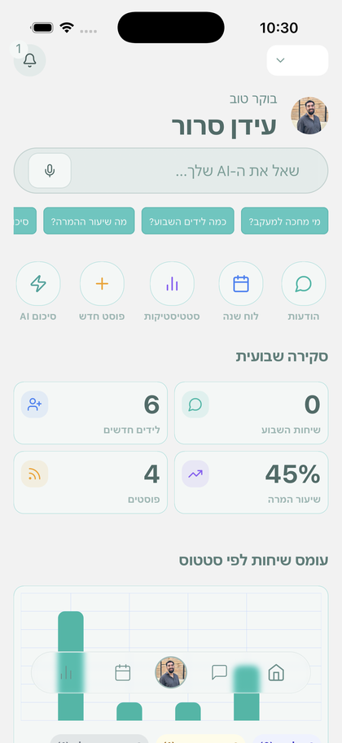
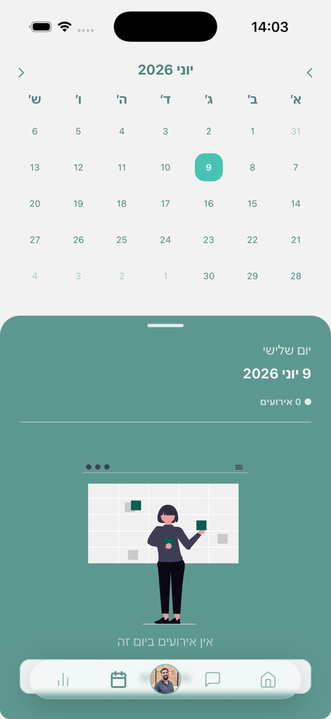
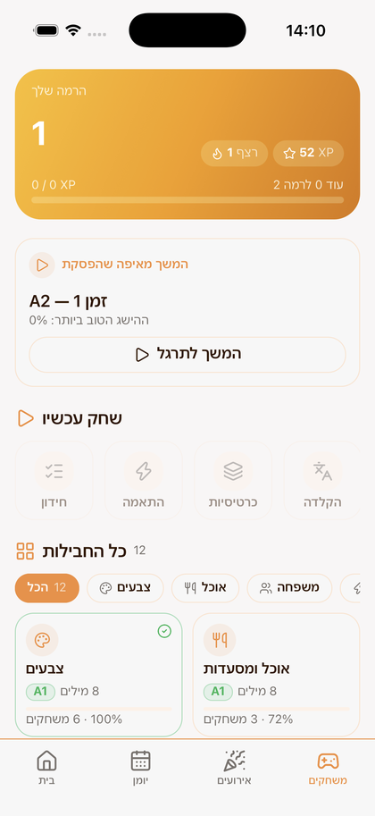
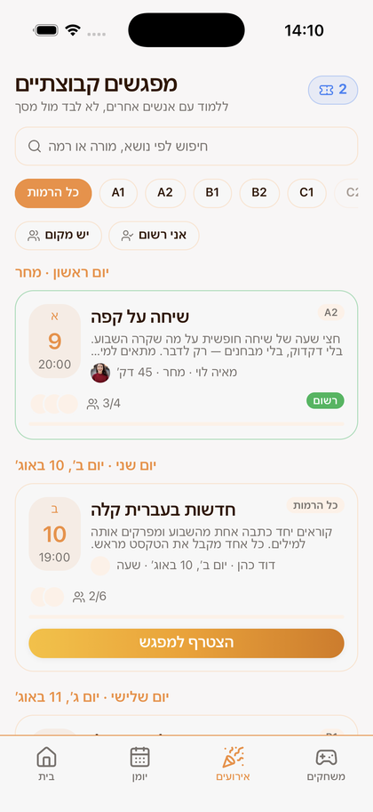
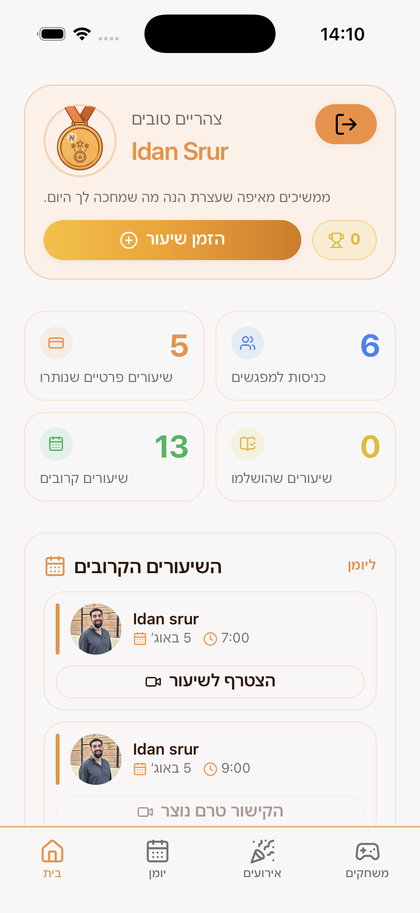

<h1 align="center">Idan Srur</h1>

  <b>React Native &amp; Full-Stack Developer</b> 
  Building education and business products end to end, from Firebase architecture to Reanimated micro-interactions.

  
  
  

---

### About me

I founded and shipped two live platforms on my own: **Webas**, a SaaS for business management published on the App Store and Google Play, and **Hemy Hebrew**, an online Hebrew learning school.

I come from a background in education and youth mentoring, and I build products where those two worlds meet. I own the whole stack: backend architecture, third-party API integrations, mobile builds and store releases, and the UX and animation layer on top.

Currently looking for a **mobile development role** where product thinking and hands-on execution both matter.

---

<h2 align="center">
   
  Webas
</h2>

  <b>SaaS platform for business management.</b> 
  A React Native app on both stores that turns an ad click into a tracked CRM lead without anyone touching a spreadsheet.

  
  
  

  
  

- Built and published the app to the App Store and Google Play end to end, including solving iOS and Android build and signing issues on my own
- Firebase backend: Firestore, Cloud Functions and FCM push notifications
- Meta Ads API, WhatsApp automation, OAuth and webhooks feeding an automated lead-to-CRM pipeline
- An in-app AI assistant scoped to real business data, answering questions like "how many leads this week" and "who is waiting for follow-up"
- Weekly analytics, conversion tracking and advanced animation with Reanimated

`React Native` `Expo` `TypeScript` `Firebase` `Cloud Functions` `FCM` `Meta Ads API` `WhatsApp API` `OAuth` `Reanimated`

---

<h2 align="center">
    <!--  -->

   
  Hemy Hebrew
</h2>

  <b>Online Hebrew learning platform and digital school.</b> 
  Gamified practice, live group sessions and private lessons, with a personal learning path per student.

  
  

  
  
  

- Gamified learning system: XP, levels, streaks and word packs, with four game modes (quiz, matching, flashcards, typing)
- Live group sessions and private lessons, filtered by CEFR level from A1 to C2, with booking and capacity handling
- AI-assisted practice and per-student progress tracking across grammar modules and drills
- Full bilingual support, Hebrew and English, including RTL layout throughout

`React` `TypeScript` `Firebase` `Firestore` `Cloud Functions`

> Both products are private repositories, so the code is not public here. Happy to walk through architecture, code, or specific problems I solved in a conversation.

---

### Tech

**Mobile**
`React Native` `Expo` `EAS` `Reanimated` `React Query` `Tamagui` `Xcode` `Android Studio`

**Backend and cloud**
`Firebase` `Firestore` `Cloud Functions` `FCM` `Node.js` `Google Cloud` `WebSockets`

**Integrations and AI**
`Meta Ads API` `WhatsApp API` `OAuth` `Webhooks` `Genkit` `Anthropic API`

**Web**
`React` `TypeScript` `JavaScript` `REST APIs` `Git`

---

### Background

- **Full Stack Development**, Coding Academy (2026 to present)
- **B.A. Criminology and Education**, Ariel University (2021 to 2024)
- Youth counselor and attendance officer, working with teens alongside development work

---

  <a href="mailto:idansrur123@gmail.com">idansrur123@gmail.com</a> &nbsp;·&nbsp;
  <a href="https://www.linkedin.com/in/idan-srur">LinkedIn</a> &nbsp;·&nbsp;
  <a href="https://webas.online">webas.online</a>

